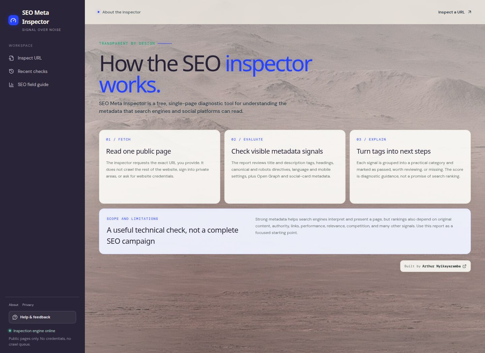

# SEO Meta Inspector

A free web tool for inspecting the metadata that search engines and social
platforms can read from a public webpage.

**Live demo:** [seo-meta-inspector.com](https://seo-meta-inspector.com/)



## What it does

Enter a public URL to receive a structured report covering:

- Page titles and meta descriptions
- Canonical URLs and robots directives
- Heading structure and language metadata
- Open Graph and social-preview tags
- Mobile and technical metadata
- Clear pass, warning, and missing-signal explanations
- Google-style and social-card previews

The application also includes browser-local inspection history, an SEO field
guide, a privacy notice, feedback delivery, responsive layouts, and
AdSense-ready placements that remain disabled until configured.

## Why I built it

SEO metadata is easy to inspect manually, but difficult to interpret when it
is spread across raw HTML and browser tooling. This project turns those signals
into a focused report that is useful to people who do not work with metadata
every day.

The goal was not to build another all-in-one SEO platform. It was to build one
small product well, with a clear interface and a typed API boundary.

## Technical highlights

- React 19 and TypeScript frontend built with Vite
- Express API for fetching and analysing public webpages
- OpenAPI specification used to generate typed Zod schemas and React Query hooks
- SSRF protections around externally supplied URLs
- Responsive and accessible UI states
- Local inspection history without requiring user accounts
- Resend feedback delivery through a Replit connector
- Open Graph, Twitter card, sitemap, robots, manifest, and structured metadata
- AdSense verification and configurable ad placements

## Architecture

```text
artifacts/
  seo-meta-inspector/   React + Vite web application
  api-server/           Express API and inspection logic
lib/
  api-spec/             OpenAPI source and code-generation configuration
  api-zod/              Generated validation schemas
  api-client-react/     Generated React Query client
  db/                   Shared database package scaffold
```

The web app calls the API through generated hooks. The API validates requests,
fetches the submitted public page, extracts its metadata, and returns a typed
inspection report.

## Running locally

### Requirements

- Node.js 20 or later
- pnpm 10 or later

### Install

```bash
pnpm install
```

### Start the API

```bash
PORT=8080 pnpm --filter @workspace/api-server run dev
```

### Start the web app

```bash
PORT=21100 BASE_PATH=/ \
  pnpm --filter @workspace/seo-meta-inspector run dev
```

The deployed Replit artifact router forwards `/api` requests from the web app
to the API service. When running outside Replit, configure your development
reverse proxy to forward `/api` to `http://localhost:8080`.

The feedback form depends on a configured Replit Resend connector. The SEO
inspection flow does not require that connector.

## Environment variables

Copy `.env.example` and configure only the values needed by your environment.
Never commit a populated `.env` file.

| Variable | Purpose |
| --- | --- |
| `PORT` | Port used by the selected service |
| `BASE_PATH` | Vite application base path |
| `DATABASE_URL` | PostgreSQL connection if the shared database scaffold is used |
| `FEEDBACK_RECIPIENT_EMAIL` | Destination for visitor feedback |
| `FEEDBACK_FROM_EMAIL` | Verified sender used for feedback emails |
| `VITE_ADSENSE_CLIENT_ID` | Public AdSense publisher ID |
| `VITE_ADSENSE_PRIMARY_SLOT` | Primary ad-unit slot ID |
| `VITE_ADSENSE_SECONDARY_SLOT` | Secondary ad-unit slot ID |

## Useful commands

```bash
# Type-check all workspace packages
pnpm run typecheck

# Build the complete workspace
pnpm run build

# Regenerate API schemas and hooks after editing OpenAPI
pnpm --filter @workspace/api-spec run codegen
```

## Security and privacy

- Submitted URLs are treated as untrusted input.
- The API blocks private and local network destinations.
- Recent checks are stored locally in the visitor's browser.
- Feedback email addresses are optional and are not published.
- Secrets and credentials are intentionally excluded from this repository.

## Project status

The application is live and usable. AdSense verification is present, while ad
units remain configuration-controlled so advertising is not loaded before the
required approval and consent setup.

## Author

Built by [Arthur Nyikayaramba](https://www.linkedin.com/in/arthur-nyikayaramba).

## License

This project is available under the [MIT License](LICENSE).
